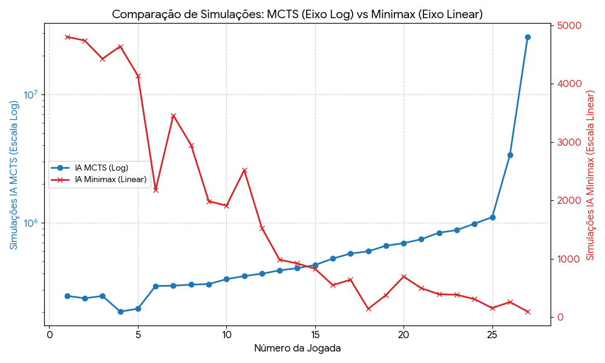

# REPORT

## Estrutura do Projeto

```bash
api/
├── dto.go
├── handler.go
├── mapper.go
game/
├── adjacency-map.go
├── constant.go
├── opening-book.go
├── professor-map.go
├── state.go
mcts/
├── engine.go
├── search.go
├── utils.go
main.go
```

O projeto possui 3 módulos principais (`api`, `game` e `mcts`), além de um arquivo de entrada que inicia o servidor (`main.go`).

### API

Aqui ficam os arquivos responsáveis por se comunicar com o ambiente externo (API do jogo) e traduzir o formato da requisição para o formato interno otimizado e vice-versa (`dto.go` e `mapper.go`).

- **`dto.go`**: Define os objetos que entram e saem da aplicação.
- **`handler.go`**: Funções responsáveis por processar as requisições (`/health` e `/move`).
- **`mapper.go`**: Funções que traduzem dos dados do formato externo para o formato interno e vice-versa.

### Game

Esse módulo detém todas as regras específicas do jogo do Projeto Integrador 5,
implementa a interface utilizada pelo algoritmo do MCTS, além de alguns utilitários.

- **`adjacency-map.go`**: Array estático com todos os vizinhos válidos de todas as casas para uma consulta $O(1)$ (ex: a casa da primeira linha e primeira coluna possui somente 3 vizinhos válidos: à direita, abaixo e à diagonal direita inferior).
- **`constant.go`**: Constantes referentes à algumas regras específicas do jogo, como o tamanho do tabuleiro.
- **`opening-book.go`**: Função que escolhe o posicionamento dos professores na fase de setup do jogo.
- **`professor-map.go`**: Funções que traduzem o nome do professor para o seu índice no formato interno e vice-versa para consultas $O(1)$.
- **`state.go`**: Formato interno e otimizado para fins de melhor performance. Também implementa a interface utilizada pelo MCTS.

### MCTS

Esse módulo tem por objetivo implementar o [Monte Carlo Tree Seach](https://en.wikipedia.org/wiki/Monte_Carlo_tree_search),
assim como fazer uso das Goroutines para paralelizar seu processo.

- **`engine.go`**: Define uma interface genérica de estado para se manter desacoplado das regras do jogo e implementa os 4 métodos principais do algoritmo.
- **`search.go`**: Recebe o estado e o tempo máximo de processamento e executa o algoritmo em paralelo.
- **`utils.go`**: Funções utilitárias relativas ao MCTS, isoladas para fins de simplificação.

## Jogador Inteligente - Estratégia

Como mencionado acima, escolhemos o Monte Carlo Tree Search como estratégia, mas ele não foi a primeira opção.

No início da elaboração da estratégia, começamos com o que seria o caminho mais tradicional, o Minimax.
Porém, acabamos pensando que esse algoritmo poderia ser óbvio demais
(o que se concretizou, uma vez que todos os grupos assim o fizeram, com exceção do nosso)
e decidimos explorar uma alternativa computacionalmente mais agressiva e menos dependente de heurísticas manuais.

Ao contrário do Minimax, o MCTS é focado em probabilidade profunda e divide-se em 4 fases (Seleção, Expansão, Rollout e Retropropagação),
gerando simulações de jogadas até o fim da partida diversas vezes.
Ele concentra o poder de processamento nas jogadas que apresentam maior probabilidade de vitória utilizando a fórmula UCT (Upper Confidence Bound for Trees).

A escolha do Go como linguagem se deu por três razões:

1. Quanto mais simulações [em menos tempo], melhor (linguagem compilada x interpretada);
2. A possibilidade de paralelizar a execução do algoritmo;
3. Tipagem de baixo nível com controle da quantidade de bytes.

Por fim, para validar a estratégia, não só jogamos contra o robô aleatório da API,
como também implementamos uma [IA com Minimax](https://github.com/DevMentalBrain/API-reGECS/tree/versao-minmax-alphabetapoda) para jogar contra e,
surpreendentemente, a IA com MCTS ganhou **todas** as vezes.

Contudo, apesar das otimizações e testes, nossa IA acabou sendo derrotada durante o campeonato oficial.


Possivelmente, isso deve ao fato de que, enquanto a nossa estratégia (mais especificamente na etapa de Rollout) se baseava puramente em jogadas aleatórias,
o Minimax do adversário buscava o movimento considerado o pior cenário absoluto.
Talvez, se tivéssemos utilizado uma heurística para guiar as nossas jogadas e evitar que o algoritmo gastasse processamento com caminhos ruins,
poderíamos ter performado melhor.

## Análise de Performance (MCTS vs Minimax)



Ao plotar a quantidade de simulações por jogada de cada IA, observamos um cruzamento de curvas pela natureza de cada abordagem.

Nas últimas jogadas do Minimax, as opções de movimento acabam e as ramificações caem para perto de zero, resolvendo a árvore de decisões rapidamente.

Já o MCTS trabalha com um limite de tempo fixo, então, no fim do jogo, simular partidas aleatórias até o final é um processo extremamente barato para a CPU, pois faltam poucas jogadas. Assim, dentro do mesmo limite de tempo, o MCTS passa a iterar em um ritmo acelerado, saltando de centenas de milhares para dezenas de milhões de cálculos redundantes e até mesmo desnecessários.
